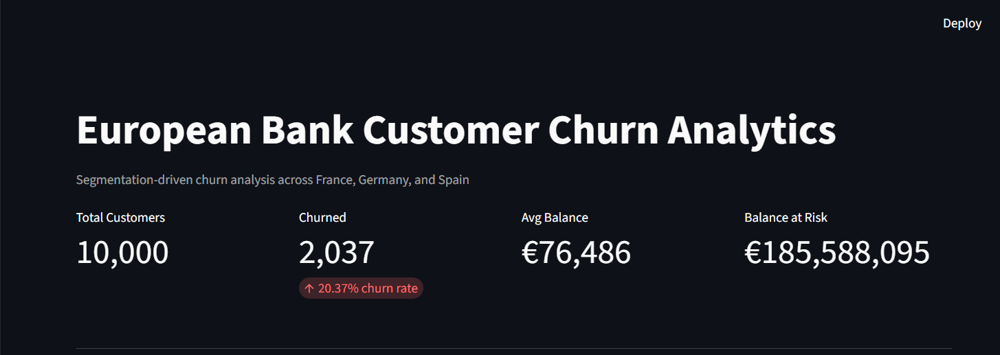
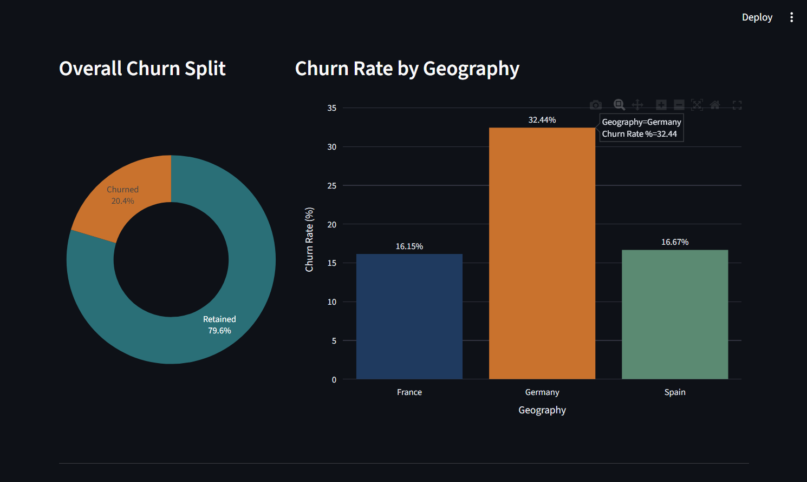
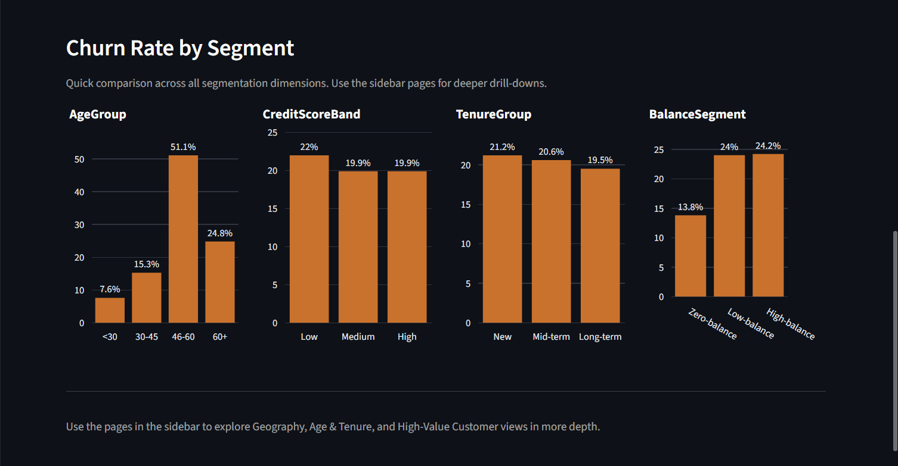

# Customer Segmentation & Churn Pattern Analytics in European Banking

End-to-end churn analytics project on 10,000 European bank customers (France, Germany, Spain) — segmentation-driven EDA, SQL analysis, and an interactive Streamlit dashboard to uncover where and why a 20.37% churn rate is concentrated.

This project analyzes churn behavior across retail banking customers from France, Germany, and Spain. Rather than treating churn as a single aggregate metric, the analysis segments customers by geography, age band, credit score tier, tenure, and account balance to identify which specific customer groups carry the highest churn risk — and what that means in terms of revenue exposure.

## Key Findings

- **Overall churn rate: 20.37%** (2,037 of 10,000 customers)
- **Geography × Age interaction is the strongest pattern in the data.** Germany's 46–60 age group churns at **67.33%** — more than double the bank-wide average, and well above the same age group in France (45.79%) and Spain (40.66%). The gap holds across all age bands in Germany, not just 46–60.
- **Engagement, not tenure, is the sharpest behavioral signal.** Churned customers are active members only 36.1% of the time vs. 55.5% for retained customers — a 19.4-point gap.
- **Account balance — not credit score or salary — predicts churn.** Within every balance segment, churn rate barely moves with credit score or income. Zero-balance customers churn least (13.82%); Low/High-balance customers churn at ~24% regardless of how creditworthy or well-paid they are.
- **Churn is concentrated among higher-value customers.** Churned customers hold a higher average balance than retained customers (€91,109 vs. €72,745), and represent 24.26% of total balance despite being 20.37% of customers — roughly €185.6M of revenue exposure.

Full methodology, tables, and recommendations are in the [research paper](https://drive.google.com/file/d/1MAOAE_ZC3_TDu4UFWEGvZHHSX8GGXWsN/view?usp=drive_link).

## Live Dashboard

🔗 **[View the live dashboard](https://bank-churn-project-srijan-p2.streamlit.app/)** *(replace with your actual Streamlit Community Cloud URL after deploying)*

## Screenshots

**Overall KPIs**


**Churn Split & Geography**


**Segment Overview**


## Tech Stack

- **Python** (pandas) — data validation, cleaning, segmentation
- **SQL** (SQLite) — churn distribution, demographic, and high-value analysis
- **Streamlit + Plotly** — interactive dashboard
- **python-docx / docx-js** — research paper generation

## Project Structure

```
bank-churn-project/
├── assets/
│   └── screenshots/                  # Dashboard screenshots used in this README
├── data/
│   ├── raw/                          # Original, untouched source CSV
│   └── processed/                    # Validated, segmented data + SQLite DB
│       └── bank_churn.db             # SQLite database (table: customers)
├── scripts/
│   ├── 01_ingest_validate.py         # Schema, dtype, null, duplicate, outlier checks
│   ├── 02_clean_segment.py           # Drops Surname, derives AgeGroup/CreditScoreBand/
│   │                                 # TenureGroup/BalanceSegment
│   ├── 03_load_to_sqlite.py          # Loads segmented data into SQLite
│   ├── 04_churn_distribution.py      # Overall + segment-wise churn rate & contribution
│   ├── 05_demographic_analysis.py    # Gender, Geography×Age interaction, financial
│   │                                 # stability vs. churn
│   ├── 06_high_value_churn.py        # High-balance churn, salary vs. balance, revenue risk
│   └── run_pipeline.py               # Runs all scripts above in order, fail-fast
├── dashboard/
│   ├── Home.py                       # Overall churn summary (entry point)
│   ├── data_loader.py                # Shared DB access, filters, color palette
│   └── pages/
│       ├── 2_Geography.py            # Geography-wise churn + age interaction
│       ├── 3_Age_and_Tenure.py       # Age/tenure comparison + engagement heatmap
│       └── 4_High_Value_Explorer.py  # High-value churn explorer + drill-down table
├── reports/
│   ├── 01_validation_report.txt
│   ├── 02_segmentation_summary.txt
│   ├── 04_churn_distribution.txt
│   ├── 05_demographic_analysis.txt
│   ├── 06_high_value_churn.txt
│   └── European_Bank_Churn_Research_Paper.docx
├── requirements.txt
└── README.md
```

## Setup

```bash
# Create and activate a virtual environment
python -m venv venv
source venv/bin/activate        # Mac/Linux
venv\Scripts\activate           # Windows

# Install dependencies
pip install -r requirements.txt
```

## Running the Pipeline

Reproduce the entire analysis from the raw CSV with a single command:

```bash
python scripts/run_pipeline.py
```

This runs all six stages in order (ingestion → validation → segmentation → SQLite load → churn distribution → demographic analysis → high-value analysis) and stops immediately if any stage fails. Each stage also writes a report to `reports/` and can be run individually, e.g.:

```bash
python scripts/04_churn_distribution.py
```

## Running the Dashboard

```bash
streamlit run dashboard/Home.py
```

Opens at `http://localhost:8501` with four pages:

| Page | Covers |
|---|---|
| **Home** | Overall KPIs, churn split, churn rate across every segment |
| **Geography** | Country-level churn, geography × age interaction, balance mix by country |
| **Age & Tenure** | Age and tenure churn comparison, engagement (active vs. inactive), age × tenure heatmap |
| **High Value Explorer** | Revenue risk summary, salary vs. balance churn pattern, sortable drill-down table of high-balance churners |

All pages share a common sidebar filter (Geography, Age Group, Balance Segment, Gender) that updates every chart and KPI dynamically.

## Data

Source: 10,000-row European retail banking customer dataset (`Year, CustomerId, Surname, CreditScore, Geography, Gender, Age, Tenure, Balance, NumOfProducts, HasCrCard, IsActiveMember, EstimatedSalary, Exited`). Validated as zero-null, zero-duplicate, with all binary and categorical fields confirmed consistent before analysis (see `reports/01_validation_report.txt`).

## Deliverables

- ✅ Reproducible Python/SQL analysis pipeline (`scripts/`)
- ✅ Interactive Streamlit dashboard (`dashboard/`)
- ✅ Research paper with findings and recommendations (`reports/European_Bank_Churn_Research_Paper.docx`)
- ⬜ Executive summary for stakeholders
